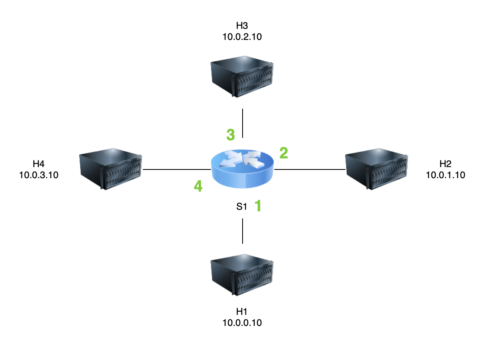
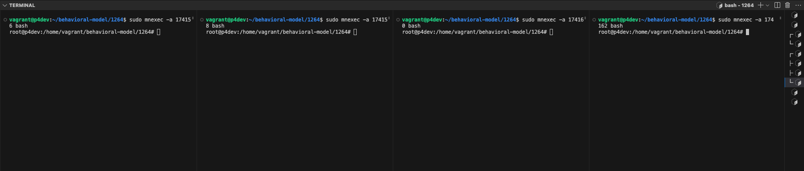
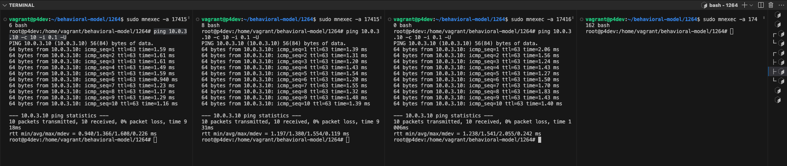
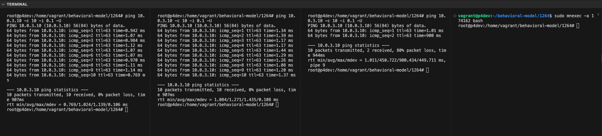
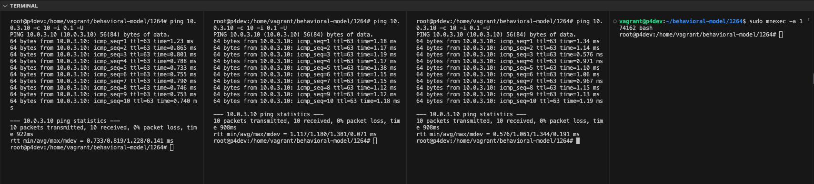
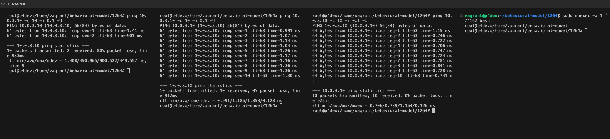

# How to Reproduce Issue #1264 in BMv2
* Link to the [issue](https://github.com/p4lang/behavioral-model/issues/1264)
* How I create the scripts:
    * 1sw_demo.py is copied from [p4lang/behavioral-model](https://github.com/p4lang/behavioral-model/blob/main/mininet/1sw_demo.py) repository with some modification such that every egress port will have 4 priority queue
    * basic.p4 is copied from [p4lang/tutorials](https://github.com/p4lang/tutorials/blob/master/exercises/basic/solution/basic.p4) repository with some modification such that every host will have its own priority queue in each egress port
    * p4_mininet.py is copied from [p4lang/behavioral-model](https://github.com/p4lang/behavioral-model/blob/main/mininet/p4_mininet.py) repository
* Dependencies:
    * p4c
    * bmv2
## Steps
1. Install p4c, follow [this](https://github.com/p4lang/p4c) guide
2. Install  bmv2, follow [this](https://github.com/p4lang/behavioral-model/tree/main) guide. Install from source, since the scripts inside this repository will be used
3. Compile basic.p4
```
p4c --target bmv2 basic.p4
```
4. Install Mininet, you can create a virtual environment and install dependencies in requirements.txt
```
python3 -m venv .venv
source .venv/bin/activate
pip instal l-r requirements.txt
```
5. Launch a Mininet network. Replace "../targets/simple_switch/....." to the path to simple_switch script inside p4lang/behavioral-model repository
```
sudo python3 1sw_demo.py --behavioral-exe ../targets/simple_switch/simple_switch --json basic.json --num-hosts 4
```
6. A network with below topology will be launched. Each port (1,2,3,4) will have 4 priority queue (0,1,2,3). Priority queue 0 for H1, 1 for H2, 2 for H3, 3 for H4. If we send a packet from H1 to H4, it will be enqueued in port 4, priority queue 0. 

7. At Mininet's terminal, execute "dump" to see all related pid for every hosts and switch. Store these pids for later
```
mininet> dump
<P4Host h1: eth0:10.0.0.10 pid=174156> 
<P4Host h2: eth0:10.0.1.10 pid=174158> 
<P4Host h3: eth0:10.0.2.10 pid=174160> 
<P4Host h4: eth0:10.0.3.10 pid=174162> 
<P4Switch s1: lo:127.0.0.1,s1-eth1:None,s1-eth2:None,s1-eth3:None,s1-eth4:None pid=174179> 
```
8. Enter table entries for S1. Don't forget to replace path to simple_switch_CLI
```
../targets/simple_switch/simple_switch_CLI < commands.txt
```
9. Test with pingall, all hosts should be connected by now
```
mininet> pingall
*** Ping: testing ping reachability
h1 -> h2 h3 h4 
h2 -> h1 h3 h4 
h3 -> h1 h2 h4 
h4 -> h1 h2 h3 
*** Results: 0% dropped (12/12 received)
```
10. Open four terminals, one for each host. In each terminal, execute this
```
sudo mnexec -a PUT_PID_HERE bash
```

11. From H1, H2, H3 terminal, ping H4 every 0.1 second until 10 packets are sent. We can see that the average RTT is around 1 ms
```
ping 10.0.3.10 -c 10 -i 0.1 -U
```

12. From another terminal, run simple_switch_CLI
```
../targets/simple_switch/simple_switch_CLI
```
13. Inside simple_switch_CLI, limit queue rate at port 4 priority queue 1 to 1 packet per second. Then, the performance should drop significantly if we send packet from H2 to H4.
```
RuntimeCmd: set_queue_rate 1 4 1
```
14. Repeat step number 10. However, the average RTT while ping-ing from H2 to H4 is still in 1 ms. It is H3 that experience a significant performance drop, a 80% packet loss. Remember that it is H2 that should experience this.

15. In simple_switch_CLI, set back queue rate at port 4 priority queue 1 to 10 packet per second, then repeat step 10. All performance should be back to normal, no packet loss.
```
RuntimeCmd: set_queue_rate 10 4 1
```

16. When ```set_queue_rate pps egress_port priority``` is executed, it will change priority number ```number_of_prio_queue - prio - 1```. In this case, instead of changing queue rate for priority queue 1, it is changing the priority queue 4-1-1 = 2.
17. To prove it further, let's change queue rate at port 4 priority queue 3 to 1 packet per second. It should not influence any host's performance while ping-ing H4, except when H4 is ping-ing itself. However, the H1's performance will be degraded significantly if our assumption in 15 is true.
```
RuntimeCmd: set_queue_rate 1 4 3
```
18. It is proven that our assumption in 15 is true
